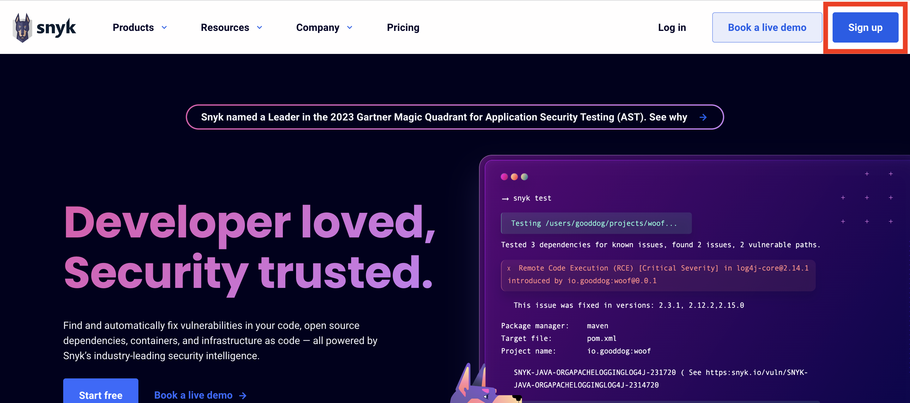
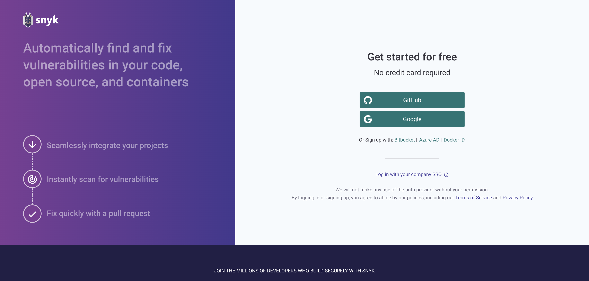
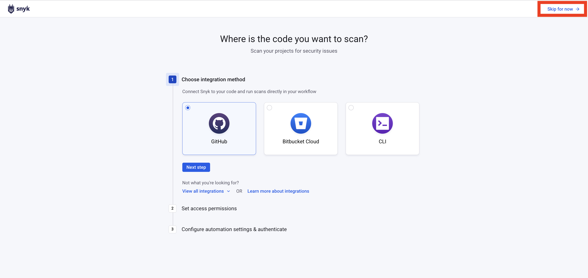
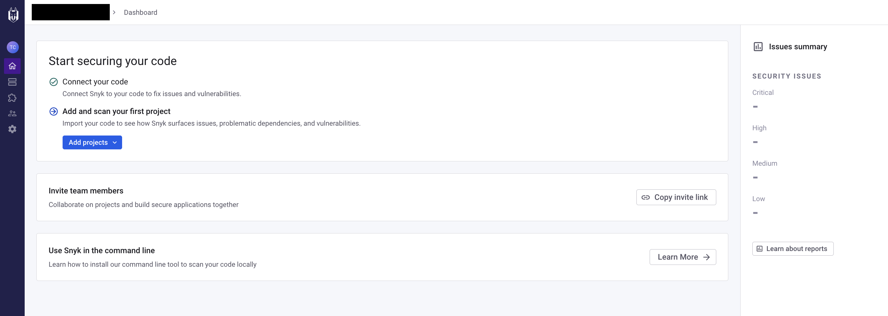

# Snyk へのサインアップ

[Snyk のアカウント作成](https://docs.snyk.io/getting-started/quickstart/create-a-snyk-account)を行います。

1\. https://snyk.io/ をクリックし、ページ右上の **Sign up** をクリックします。

2\. Snyk アカウントへ SSO を行う、サインアップ方法を選択します。

3\. Snyk との統合を求められますが、今回は利用しないため（後からでも設定可能）、ページ右上の **Skip for now** を選択します。

Snyk の画面にログインできたら、セットアップ完了です。

[Next: 開発環境(Cloud9)のセットアップ](./create_environment.md)