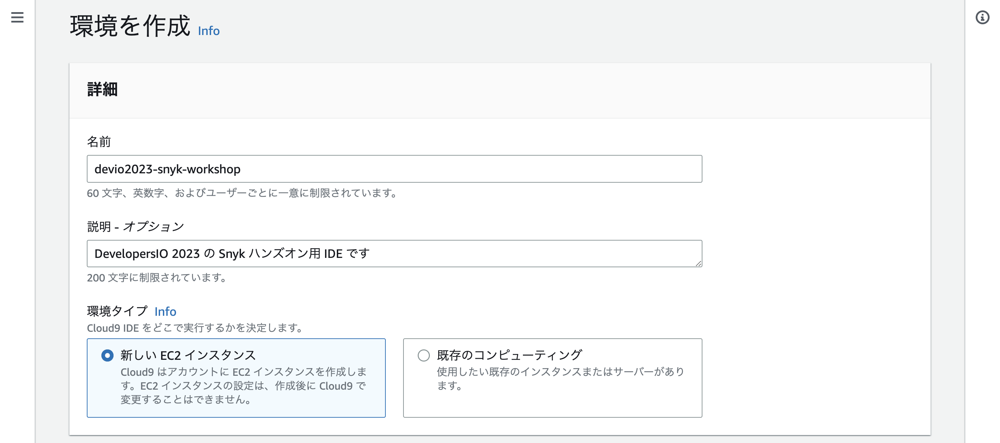
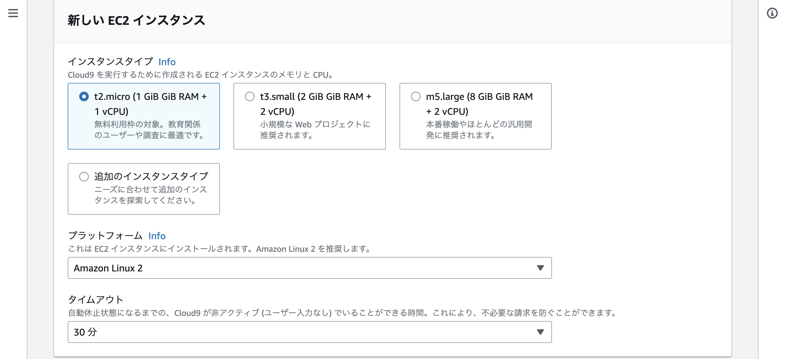
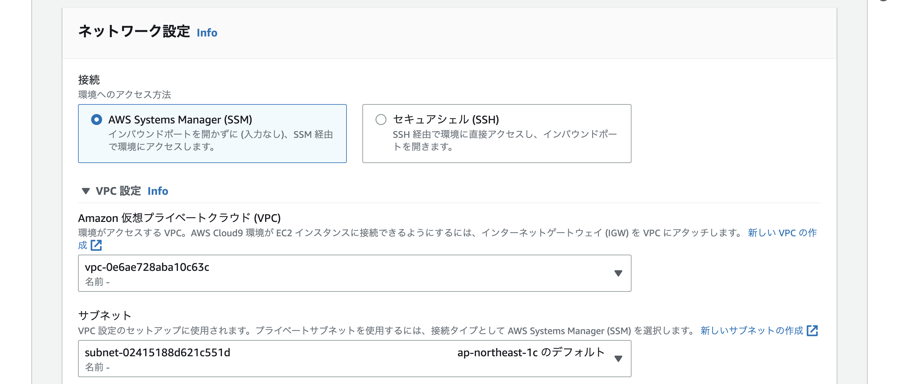

# 開発環境のセットアップ
## AWS Cloud9 をセットアップする

このワークショップには [AWS Cloud9](https://aws.amazon.com/jp/cloud9/) が開発環境として最適です。このワークショップに必要なすべてのソフトウェアがすでにプリインストールされているため、作業中のトピックに集中する時間が節約されます。

1\. AWS コンソールの検索バーに **Cloud9** と入力し、**[ 環境を作成 ]** をクリックします。

2\. 環境の名前と説明（例えば 名前 に devio2023-snyk-workshop など。Description は任意です。）を入力します。
3\. 環境タイプは **新しい EC2 インスタンス** を選択します。

4\. インスタンスタイプは **t2.micro (1 GiB GiB RAM + 1 vCPU)** 、プラットフォームは **Amazon Linux 2** 、タイムアウトは **30 分** を選択します。

5\. VPC とサブネットの選択を行います。インターネットへ到達可能な VPC とサブネットの組み合わせを選択してください。

