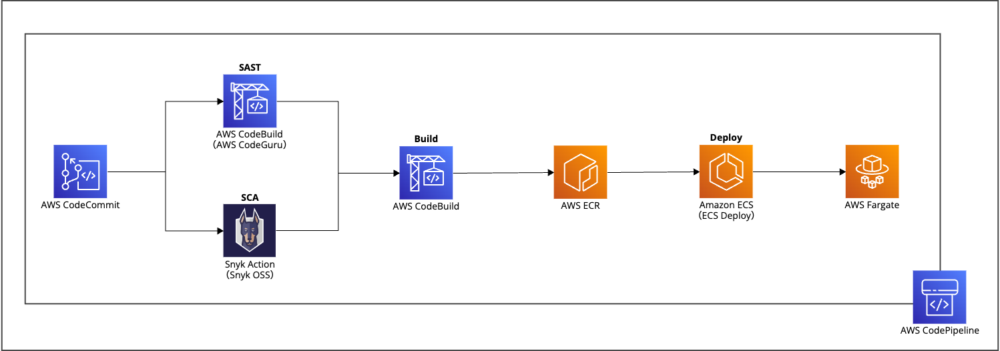

# 2. リリースの自動化

このラボでは、リリースパイプラインの最初のイテレーションを設定します。パイプラインの初期アーキテクチャでは、次の AWS サービスが使用されます。

- [AWS CodeCommit](https://aws.amazon.com/jp/codecommit/) : Git リポジトリとして使用します
- [AWS CodeBuild](https://aws.amazon.com/jp/codebuild/) : ウェブアプリケーションからコンテナを構築し、プライベートコンテナレジストリに公開します
- [Amazon ECR](https://aws.amazon.com/jp/ecr/) : プライベートコンテナレジストリです
- [AWS CodePipeline](https://aws.amazon.com/jp/codepipeline/) : リリースパイプラインを調整する継続的デリバリーサービスです
- [Amazon ECS on Fargate](https://aws.amazon.com/jp/fargate/) : ウェブアプリケーションのデプロイ先となるコンピューティングエンジンです

ラボを進めながら、それぞれのセキュリティに重点を置いた ビルドステップをゆっくり紹介します。

### カバーするトピック

このラボの終了までに、次のことができるようになります。

- AWS Cloud9 環境を使用し、AWS CDK により AWS リソースをデプロイする
- リリースパイプラインの構築に必要な AWS サービスをプロビジョニングする

[Next](./download-project-files.md)