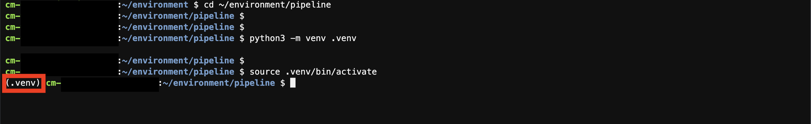

# AWS CDK の設定

> **Note**
>
> ここで定義する手順は、**ワークショップに進む前に実行する**必要があります。ワークショップ中に AWS リソースのデプロイで問題が発生した場合は、ここに戻ってください。

このセクションでは、リリースパイプラインをデプロイするために、動作している CDK 環境を設定します。次の手順で python プロジェクトをブートストラップすることに気付くかもしれません。これは、リリースパイプラインの CDK コンストラクトが Python で書かれているためです。

1\. AWS Cloud9 に進み、ターミナルウィンドウに次のコマンドを入力します。

2\. Cloud9 にプリインストールされた Python ライブラリを維持するために、プロジェクト専用の仮想 Python 環境を作成することを強くお勧めします。仮想環境を作成するには、Cloud9 ターミナルウィンドウに次のコマンドを入力します。

3\. それでは、仮想環境をアクティベートしましょう

> **Note**
>
> AWS アカウントからログアウトし、AWS Cloud9 をリロードした場合には、この仮想環境を使用することを Python に明示的に指定するため、上記を再実行してください。

4\. 仮想環境がアクティブになると、現在のターミナルセッションが仮想環境を使用していることが示されます（シェルの左端に `.venv` と示されています）。



5\. 次のコマンドで必要なライブラリをインストールしましょう。

```
pip install -r requirements.txt
```

リリースパイプラインをデプロイする準備が整いました。次のセクションに進んでください。

[Next](./deploy-pipeline.md)