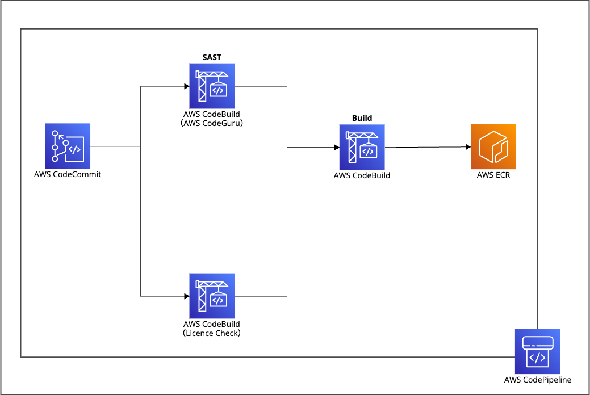
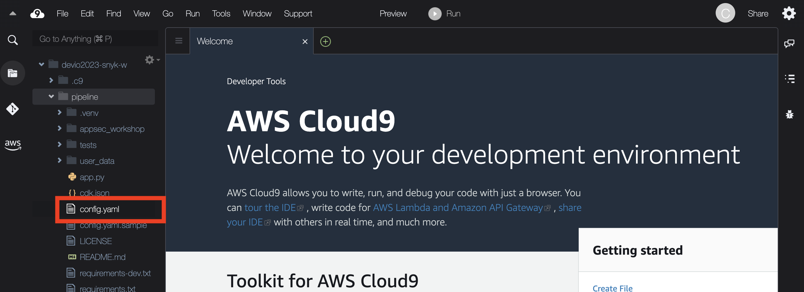
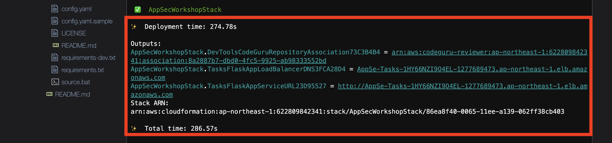

# パイプラインとツールのデプロイ

AWS CDK のセットアップが完了したため、リリースパイプラインをデプロイします。

今回の AWS CDK で以下のリソースをデプロイします。 Snyk アクションは、手動でデプロイするため、このセクションで作成されなくても問題ないです。



1\. AWS Cloud9 のターミナルウィンドウに戻り、 **pipeline** フォルダの下の **config.yaml.sample** から **config.yaml** という名前の新しいファイルを作成しましょう。

```bash
cd ~/environment/pipeline
cp config.yaml.sample config.yaml
```

2\. 左側にある Cloud9 のエクスプローラーをクリックして、新しく作成したファイル (**config.yaml**) を開きます。



3\. このワークショップでは **config.yaml** を利用してパイプラインの特定のビルドステージを有効/無効にする仕組みになっています。

```yaml
### Staging Auto-Deploy
auto_deploy_staging: False
initial_image: public.ecr.aws/adelagon/flask-app:latest

### Static Application Security Testing (SAST) Step
sast:
  enabled: True

### Software Composition Analysis (SCA) Step
sca:
  enabled: True

### License Checker Step
license:
  enabled: True

### Dynamic Application Security Testing (DAST) Step
dast:
  enabled: False
  zaproxy:
    instance_type: t3.medium
    api_key: SomeRandomString
```

4\. **config.yaml** を次のように変更してください。

```yaml
### Staging Auto-Deploy
auto_deploy_staging: False
initial_image: public.ecr.aws/adelagon/flask-app:latest

### Static Application Security Testing (SAST) Step
sast:
  enabled: True

### Software Composition Analysis (SCA) Step
sca:
  enabled: False

### License Checker Step
license:
  enabled: True

### Dynamic Application Security Testing (DAST) Step
dast:
  enabled: False
  zaproxy:
    instance_type: t3.medium
    api_key: SomeRandomString
```

<details>
<summary>変更差分</summary>

```diff
### Staging Auto-Deploy
auto_deploy_staging: False
initial_image: public.ecr.aws/adelagon/flask-app:latest

### Static Application Security Testing (SAST) Step
sast:
  enabled: True

### Software Composition Analysis (SCA) Step
sca:
-  enabled: True
+  enabled: False

### License Checker Step
license:
  enabled: True

### Dynamic Application Security Testing (DAST) Step
dast:
  enabled: False
  zaproxy:
    instance_type: t3.medium
    api_key: SomeRandomString
```
</details>

5\. AWS CDK では `cdk` コマンドを実行する前に、CDK を利用するために必要なリソースをプロビジョニング（[ブートストラッピング
](https://docs.aws.amazon.com/ja_jp/cdk/v2/guide/bootstrapping.html)）する必要があります。 Cloud9 ターミナルに以下を入力するだけで、プロビジョニング出来ます。

```bash
cdk bootstrap
```

6\. 次に、CDK が正しくインストールされ、構成されているかどうかをテストしましょう。Cloud9 のターミナルで以下のコマンドを入力します。リリースパイプライン構築のための結合された CloudFormation テンプレートが表示されるはずです。

```bash
cdk synth
```

7\. Cloud9 のターミナルウィンドウで、以下のコマンドでリリースパイプラインをデプロイしてみましょう。

```bash
cdk deploy --require-approval never
```

8\. CDK のデプロイを数分待ってみましょう。 AWS リソースのプロビジョニング中に、(**pipeline/appsec_workshop** フォルダーの下) CDK コンストラクトのいくつかを調べてみましょう。CDK が完了すると、次のような出力が得られるはずです。



次のセクションに進み、展開した内容を調べてください。

[Next: 構築された環境の確認](./explore-the-environment.md)