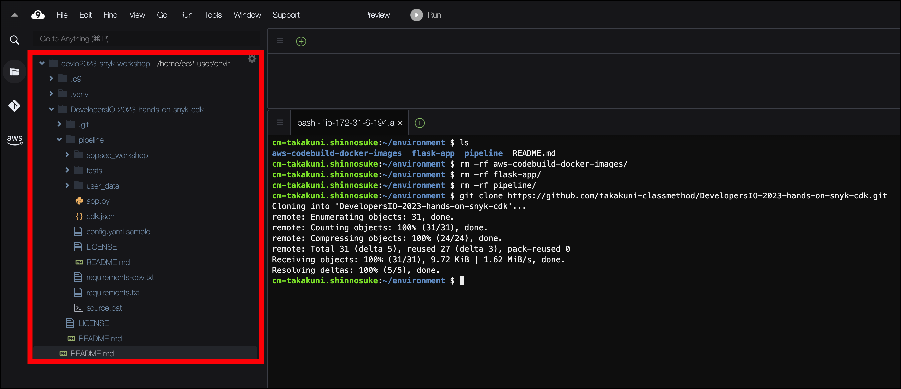

# Project File のダウンロード

このワークショップは、 AWS CDK を利用して、リソースパイプラインをデプロイます。

このタスクでは、ソースコードの一式を Cloud9 環境にダウンロードします。

1\. AWS Cloud9 に進み、ターミナルウィンドウに入り、次のコマンドを貼り付けて、コードをダウンロードします。

```bash
git clone https://github.com/takakuni-classmethod/DevelopersIO-2023-hands-on-snyk-cdk.git
```

2\. リリース自動化用の CDK コンストラクトを含む **DevelopersIO-2023-hands-on-snyk-cdk** という名前の新しいフォルダが表示されます。次のセクションに進み、環境にデプロイしましょう。



[Next: AWS CDK の設定](./configure-cdk.md)