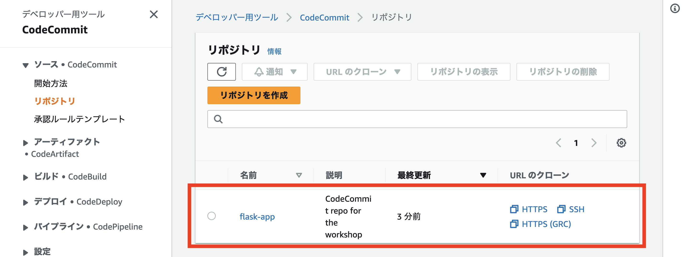
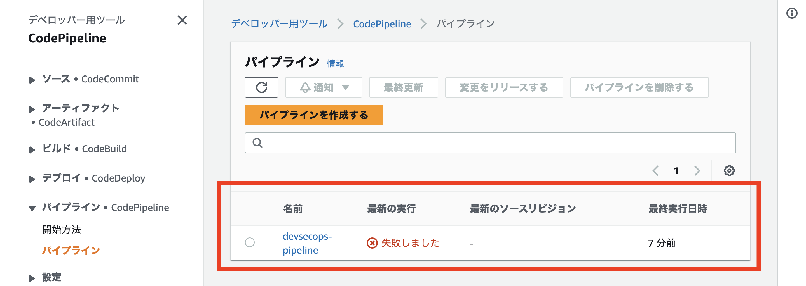

# 構築された環境の確認

先に進む前に、AWS CDK がプロビジョニングした内容について理解しておきましょう。

1\. AWS コンソールの検索バーに **CodeCommit** と入力して AWS CodeCommit ダッシュボードを開き、**flask-app** という名前の Git リポジトリが作成されたことを確認します。ここではウェブアプリケーションのコードが管理されますが、現時点では**何のファイルも入っていない空のリポジトリ**です。また、AWS CDK が **CloudWatch Event Rule** を作成して、開発者がコードを push するたびにリリースパイプラインをトリガーするようにしました。

2\. 次に、リリースパイプラインがどのように見えるか見てみましょう。左側のメニューから **[パイプライン]** の下の **[パイプライン]** をクリックします。**devsecops-pipeline** という名前の新しいパイプラインがあるはずです。CodeCommit リポジトリは現時点で空であるため、失敗と表示されているのは想定通りです。

3\. Pipelinesのリストから **devsecops-pipeline** をクリックすると、 3 つのステージがあることがわかるはずです。**CheckoutSource** ステージは、CodeCommit リポジトリにコードの変更があるたびにトリガーされます。

また、 **ApplicationSecurityChecks** というステージがあり、SAST、SCA というアクションが含まれていることにお気づきでしょうか。これらのアプリケーションセキュリティチェックは互いに依存しないため、パイプラインを高速化するため並行して実行することは理にかなっています。

AWS CodePipelineでは、パイプライン構造で [runOrder](https://docs.aws.amazon.com/ja_jp/codepipeline/latest/userguide/reference-pipeline-structure.html) を指定することで、並行してアクションを実行できます。 セキュリティチェックがすべて合格したら、 **BuildImage** ステージを実行し、Webアプリケーションのコンテナイメージを作成します。

