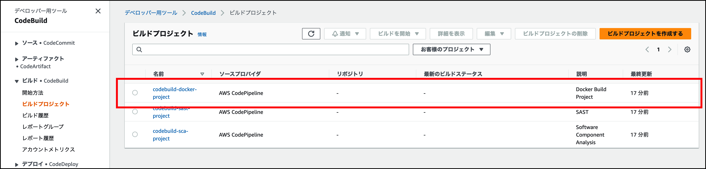
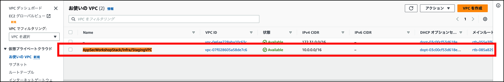

# 構築された環境の確認

先に進む前に、 AWS CDK がプロビジョニングした内容について理解しておきましょう。

1\. AWS コンソールの検索バーに **CodeCommit** と入力して AWS CodeCommit ダッシュボードを開き、**flask-app** という名前の Git リポジトリが作成されたことを確認します。このリポジトリではウェブアプリケーションのコードが管理されますが、現時点では**何のファイルも入っていない空のリポジトリ**です。また、 **CloudWatch Events Rule** を作成して、開発者がコードを push するたびにリリースパイプラインがトリガーされるように設定しています。

2\. 次に、リリースパイプラインがどのように見えるか見てみましょう。左側のメニューから **[パイプライン]** の下の **[パイプライン]** をクリックします。

**devsecops-pipeline** という名前の新しいパイプラインがあるはずです。 CodeCommit リポジトリは現時点で空であるため、失敗と表示されているのは想定通りです。

3\. Pipelinesのリストから **devsecops-pipeline** をクリックすると、 3 つのステージがあることがわかるはずです。**CheckoutSource** ステージは、CodeCommit リポジトリにコードの変更があるたびにトリガーされます。

また、 **ApplicationSecurityChecks** というステージがあり、SAST, SCA というアクションが含まれていることにお気づきでしょうか。これらのアプリケーションセキュリティチェックは互いに依存しないため、パイプラインを高速化するため並行して実行することは合理的です。

AWS CodePipeline では、パイプライン構造に [runOrder](https://docs.aws.amazon.com/ja_jp/codepipeline/latest/userguide/reference-pipeline-structure.html) を指定することで、並行してアクションを実行できます。 セキュリティチェックがすべて合格したら、 **BuildImage** ステージを実行し、 Web アプリケーションのコンテナイメージを作成します。

**BuildImage** ステージを定義する CodeBuild プロジェクトを確認してみましょう。

4\. マネジメントコンソールの 検索バーに **CodeBuild** と入力し、CodeBuild を選択すると AWS CodeBuild のダッシュボードが表示されます。 **codebuild-docker-project** という名前の CodeBuild プロジェクトが表示されているはずです。

5\. CodeBuild プロジェクトが実際に行っていることを詳しく知るには、 Build プロジェクト一覧から **codebuild-docker-project** をクリックし、 **ビルドの詳細** タブをクリックします。

6\. ビルドの詳細ページを下にスクロールすると、 **Buildspec** セクションに **docker_buildspec.yaml** の現在の値が表示されています。 **[Buildspecs](https://docs.aws.amazon.com/ja_jp/codebuild/latest/userguide/build-spec-ref.html)** は、 CodeBuild がビルドを実行するために使用するビルドコマンドと環境変数などを設定するファイルです。このラボでは、 buildspecs は コードベース （CodeCommit）から取得することになります。 CodeBuild は Web アプリケーションのコードから docker_buildspec.yaml という名前のファイルを探し、実行します。

> **Note**
> 
> 組織のルールによっては Buildspec の修正をデベロッパーに制限する場合があります。 Buildspec は、コードベースから定義するのではなく、CodeBuild または S3 から直接プロビジョニングするよう選択することもできます (https://docs.aws.amazon.com/codebuild/latest/userguide/build-spec-ref.html  を参照)。

7\. BuildImage ビルドステップは、コンテナを Amazon ECR のプライベートリポジトリにも公開します。コンテナリポジトリを表示するために、AWS コンソールの検索バーに ECR と入力し、Amazon ECR の [リポジトリ] を選択します。 **flask-app** という名前の新しいプライベートリポジトリが表示されるはずです。

8\. CDK は、ウェブアプリケーションがホストされる VPC をプロビジョニングする必要があります。AWS コンソールの検索バーに **VPC** と入力し、VPC ダッシュボードへのリンクをクリックします。左側のメニューから **[VPC]** リンクをクリックして、**AppSecWorkshopStack/Infra/StagingVPC** という名前の新しい VPC が自動的にプロビジョニングされていることを確認します。

9\. StagingVPC は、以下のような 2 つの Availability Zone に 4 つのサブネットで構成されています。

次のセクションに進み、ウェブアプリケーションの脆弱性を確認してみましょう！

[Next: 3. OWASP Top 10](../module3/owasp.md)