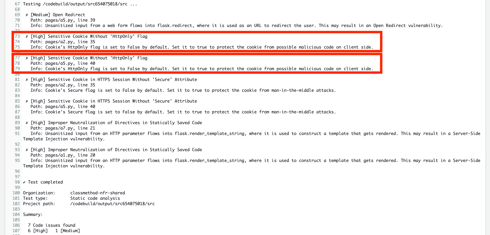

# クッキーの保護

Snyk Code で **Sensitive Cookie Without 'HttpOnly' Flag** と検出されたものを是正していきます。

このセキュリティの問題は、保護されていない Cookie による潜在的な XSS 脆弱性です。モジュール3での XSS 演習 では、攻撃者は、ブラウザのクッキーと一緒に別のウェブページにリダイレクトするようにブラウザを強制するクライアントサイドの JavaScript コードを注入することによって、ユーザの sessionId を盗み出すことができました。



これを防ぐ方法の 1 つは、設定したクッキーを HttpOnly として指定してマークすることです。これによりウェブサイトが設定したクッキーが他のドメインからアクセスできないようにブラウザに指示します。これは比較的簡単な修正です。AWS Cloud9 を開いてください。

1\. Snyk Code が認識したファイルは 2 つあります。まず、 **pages/a2.py** を編集して、以下のコードに置き換えましょう。変更は **35** 行目で、クッキーが設定されたときに **httponly** を有効にします。

```python {.line-numbers}
from flask import (
    Blueprint,
    request,
    redirect,
    render_template,
    make_response
)
from models import get_user_by_password
from utils import (
    generate_session,
    parse_session
)

bp = Blueprint(
    "a2", __name__,
    template_folder='templates',
    static_folder='static'
)

@bp.route("/A2")
def a2():
    return render_template("a2.html")

@bp.route("/A2/auth", methods=['POST'])
def a2_auth():
    username = request.form.get("username")
    password = request.form.get("password")
    user = get_user_by_password(username, password)
    if not user:
        return render_template("error.html", message="Invalid Crendentials")

    # Generate SessionID
    session_id = generate_session(username)
    response = make_response(redirect("/owasp/A2/welcome"))
    response.set_cookie("sessionId", session_id, httponly=True)

    return response

@bp.route("/A2/welcome")
def a2_welcome():
    if not request.cookies.get("sessionId"):
        return ("<h1>Not Authorized!</h1>")
    session_obj = parse_session(request.cookies.get("sessionId"))
    
    return render_template("welcome.html", username=session_obj['username'])
```