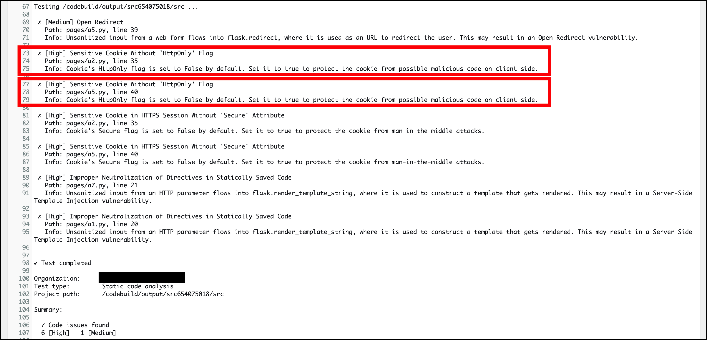
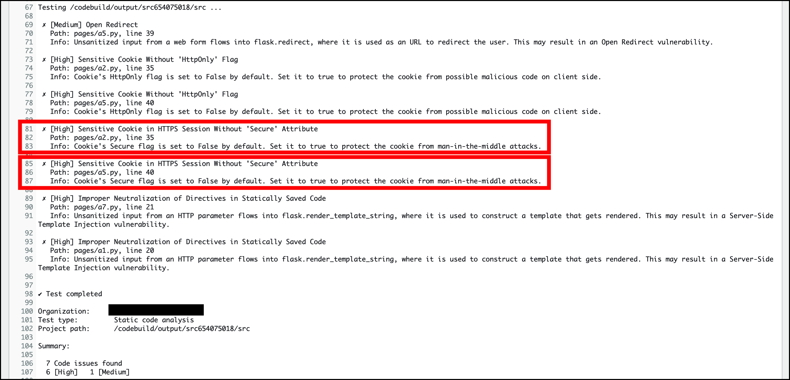

# クッキーの保護

Snyk Code で **Sensitive Cookie Without 'HttpOnly' Flag** と検出されたものを是正していきます。

このセキュリティの問題は、保護されていない Cookie による潜在的な XSS 脆弱性です。モジュール3での XSS 演習 では、攻撃者は、ブラウザのクッキーと一緒に別のウェブページにリダイレクトするようにブラウザを強制するクライアントサイドの JavaScript コードを注入することによって、ユーザの sessionId を盗み出すことができました。



これを防ぐ方法の 1 つは、設定したクッキーを HttpOnly として指定してマークすることです。これによりウェブサイトが設定したクッキーが他のドメインからアクセスできないようにブラウザに指示します。これは比較的簡単な修正です。AWS Cloud9 を開いてください。

1\. Snyk Code が認識したファイルは 2 つあります。まず、 **pages/a2.py** を編集して、以下のコードに置き換えましょう。変更は **35** 行目で、クッキーが設定されたときに **httponly** を有効にします。

```diff {.line-numbers}
from flask import (
    Blueprint,
    request,
    redirect,
    render_template,
    make_response
)
from models import get_user_by_password
from utils import (
    generate_session,
    parse_session
)

bp = Blueprint(
    "a2", __name__,
    template_folder='templates',
    static_folder='static'
)

@bp.route("/A2")
def a2():
    return render_template("a2.html")

@bp.route("/A2/auth", methods=['POST'])
def a2_auth():
    username = request.form.get("username")
    password = request.form.get("password")
    user = get_user_by_password(username, password)
    if not user:
        return render_template("error.html", message="Invalid Crendentials")

    # Generate SessionID
    session_id = generate_session(username)
    response = make_response(redirect("/owasp/A2/welcome"))
-    response.set_cookie("sessionId", session_id)
+    response.set_cookie("sessionId", session_id, httponly=True)

    return response

@bp.route("/A2/welcome")
def a2_welcome():
    if not request.cookies.get("sessionId"):
        return ("<h1>Not Authorized!</h1>")
    session_obj = parse_session(request.cookies.get("sessionId"))
    
    return render_template("welcome.html", username=session_obj['username'])
```

2\. **pages/a5.py** でも 40 行目を同様に修正します。

```diff {.line-numbers}
from flask import (
    Blueprint,
    request,
    redirect,
    make_response,
    render_template
)

from models import (
    get_user,
    get_user_by_password
)

from utils import (
    generate_session,
    parse_session
)

bp = Blueprint(
    "a5", __name__,
    template_folder='templates',
    static_folder='static'
)

@bp.route("/A5")
def a5():
    return render_template("a5.html")

@bp.route("/A5/auth", methods=['POST'])
def a5_auth():
    username = request.form.get("username")
    password = request.form.get("password")
    user = get_user_by_password(username, password)
    if not user:
        return render_template("error.html", message="Invalid Credentials")
    
    # Generate SessionID
    session_id = generate_session(username)
    response = make_response(redirect("/owasp/A5/profile/{}".format(username)))
-    response.set_cookie("sessionId", session_id)
+    response.set_cookie("sessionId", session_id, httponly=True)
    
    return response

@bp.route("/A5/profile/<username>")
def a5_profile(username):
    if not request.cookies.get("sessionId"):
        return ("<h1>Not Authorized!</h1>")
    session = parse_session(request.cookies.get("sessionId"))
    user = get_user(username)
    if not user:
        return render_template("404.html")
    return render_template("profile.html", user=user)
```

また、 Cookie の Secure 属性も有効にする必要がある、との示唆があります。これは強く推奨されます。これにより、ブラウザは暗号化されていない HTTP リクエストでクッキーを送信できなくなります。しかし、残念ながら現在のラボ環境では独自のドメインを購入/使用できないため、ここでは AWS ACM を使用することはできません。一旦、これらの調査結果を無視するよう設定します。（あくまでこのワークショップの中でのみこのようにします）。



3\. **pages/a2.py** を編集して、以下のコードに置き換えましょう。**35** 行目に検出を無視するルールを追記します。

```diff {.line-numbers}
from flask import (
    Blueprint,
    request,
    redirect,
    render_template,
    make_response
)
from models import get_user_by_password
from utils import (
    generate_session,
    parse_session
)

bp = Blueprint(
    "a2", __name__,
    template_folder='templates',
    static_folder='static'
)

@bp.route("/A2")
def a2():
    return render_template("a2.html")

@bp.route("/A2/auth", methods=['POST'])
def a2_auth():
    username = request.form.get("username")
    password = request.form.get("password")
    user = get_user_by_password(username, password)
    if not user:
        return render_template("error.html", message="Invalid Crendentials")

    # Generate SessionID
    session_id = generate_session(username)
    response = make_response(redirect("/owasp/A2/welcome"))
+    # deepcode ignore WebCookieMissesCallToSetSecure: This is test environment.
    response.set_cookie("sessionId", session_id, httponly=True)

    return response

@bp.route("/A2/welcome")
def a2_welcome():
    if not request.cookies.get("sessionId"):
        return ("<h1>Not Authorized!</h1>")
    session_obj = parse_session(request.cookies.get("sessionId"))
    
    return render_template("welcome.html", username=session_obj['username'])
```

4\. **pages/a5.py** でも同様に 40 行目を追記します。

```diff {.line-numbers}
from flask import (
    Blueprint,
    request,
    redirect,
    make_response,
    render_template
)

from models import (
    get_user,
    get_user_by_password
)

from utils import (
    generate_session,
    parse_session
)

bp = Blueprint(
    "a5", __name__,
    template_folder='templates',
    static_folder='static'
)

@bp.route("/A5")
def a5():
    return render_template("a5.html")

@bp.route("/A5/auth", methods=['POST'])
def a5_auth():
    username = request.form.get("username")
    password = request.form.get("password")
    user = get_user_by_password(username, password)
    if not user:
        return render_template("error.html", message="Invalid Credentials")
    
    # Generate SessionID
    session_id = generate_session(username)
    response = make_response(redirect("/owasp/A5/profile/{}".format(username)))
+    # deepcode ignore WebCookieMissesCallToSetSecure: This is test environment.
    response.set_cookie("sessionId", session_id, httponly=True)
    
    return response

@bp.route("/A5/profile/<username>")
def a5_profile(username):
    if not request.cookies.get("sessionId"):
        return ("<h1>Not Authorized!</h1>")
    session = parse_session(request.cookies.get("sessionId"))
    user = get_user(username)
    if not user:
        return render_template("404.html")
    return render_template("profile.html", user=user)
```

修正が終わったら、 SSIT の修正に入ります。

[Next: SSTI 脆弱性の修正](./fix-ssti-vulnerability)