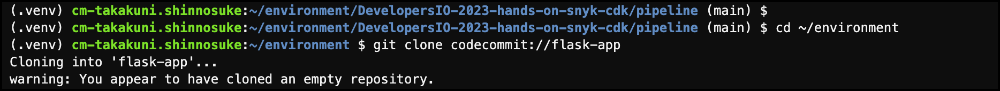
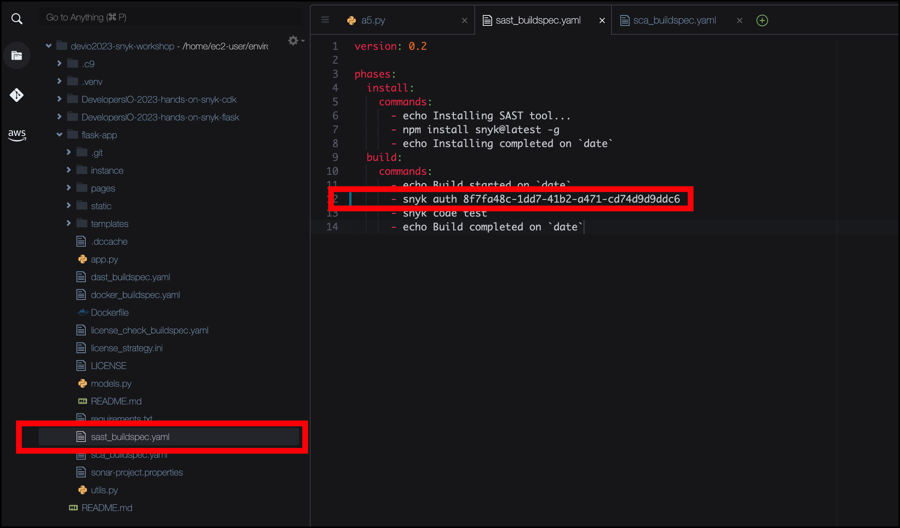
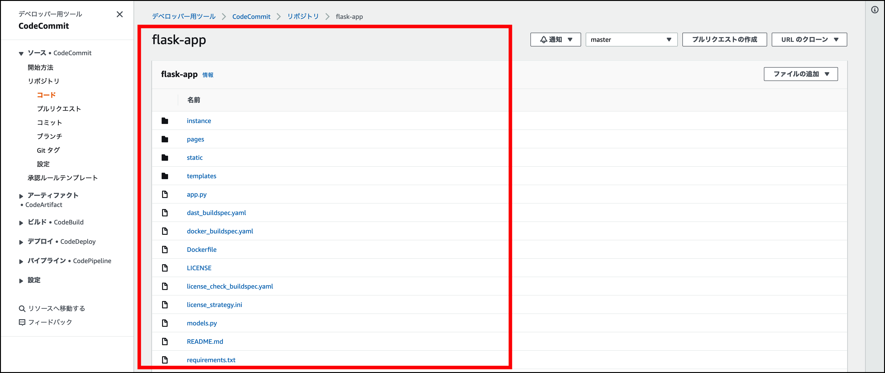

# ソースコードリポジトリの準備

**自動化されたリリースパイプライン** のプラットフォームが準備できたので、 Web アプリケーションをデプロイしてみましょう。デプロイ先は、CDK によって作成されたステージング VPC のパブリックサブネットにECS on Fargate でプロビジョニングします。

1\. 下記のコマンドをターミナルで実行し Git リポジトリをクローンします。

```bash
cd ~/environment
git clone codecommit://flask-app
```

2\. ***You appear to have cloned an empty repository*** という警告は無視してください。このあとリポジトリにコードを登録する必要があります。



3\. ウェブアプリケーションのコードを Cloud9 環境にダウンロードするには、ターミナルウィンドウに次のコマンドを入力します。

```bash
cd ~/environment
git clone https://github.com/takakuni-classmethod/DevelopersIO-2023-hands-on-snyk-flask.git
cp -pR ~/environment/DevelopersIO-2023-hands-on-snyk-flask/flask-app/* ~/environment/flask-app/
cd ~/environment/flask-app
```

4\. CI に Snyk を組み込みます。 **flask-app/sast_buildspec.yaml** の 12 行目を編集し、 Snyk Token を貼り付けます。

> **Warning**
>
> ワークショップの便宜上、ハードコーディングを行なっていますが、実際の商用環境で Snyk のトークンを利用する際は、ハードコーディングを避け、Systems Manager や Secrets Manager に保管するように設定してください。



5\. Web アプリケーションのコードが手に入ったので、あとは Git リポジトリに公開するだけです。しかし、その前に Git に自己紹介をしましょう。これは、 Git が匿名であることを警告するのを防ぐためです。

```bash
git config user.name "<Your Name>"
git config user.email "<You Email Address>"
```

6\. ダウンロードしたコードを Git に追加し、Commit した後、以下のコマンドで AWS CodeCommit に Push してみましょう。

```bash
git add .
git commit -a -m "Initial Commit"
git push
```

7\. CodeCommit にプッシュされたかを確認してみましょう。 AWS CodeCommit のダッシュボードで、 リポジトリのリストから **flask-app** を選択します。リポジトリが空でなくなっていることが確認できます。



8\. AWS CodePipeline のダッシュボードにも入ってみると、 **devsecops-pipeline** は、 git push をしたときに自動的にトリガーされています。


9\. パイプラインが SAST ステップを終了するまで、少し時間をおいてください。他のアプリケーションセキュリティチェック（SCA）も実行され、最終的に失敗することに気づくかもしれませんが、次のセクションでその発見に対処します。また、SAST CodeBuild ステージの進行状況は、以下の **詳細** リンクをクリックすることで確認することができます。


10\. SAST の実行が成功したら、 手順 9 の詳細リンクから CodeBuild のビルドログを確認してみましょう。以下の添付画像の場合、 7 件のイシューが発生していることがわかります。


コードを変更する前に、次のモジュールに移って、Webアプリケーションのコードベースがどのように構成されているかを少し説明しましょう。

[Next: コードの概要](./code-overview.md)