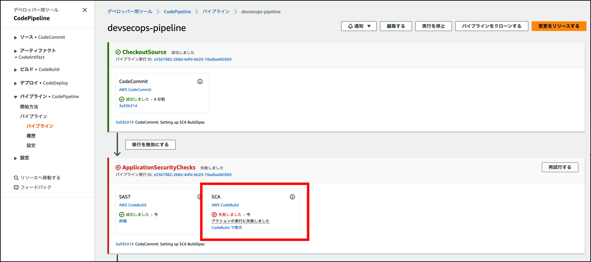
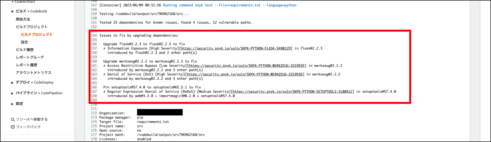

# 依存関係のチェック

1\. CodePipeline を見てみると、ウェブアプリケーションに安全でない依存関係があるため、 SCA ステージが失敗していることに気付くでしょう。何が起こったのかを確認するために、 **CodeBuild の表示** をクリックしてください。これにより、 SCA ステップ専用の CodeBuild プロジェクトが開かれます。

2\. ビルドログを確認すると、ウェブアプリケーションが現在使用している **flask**, **werkzeug**, **setuptools** の安全でないバージョンに関する Snyk OSS のレポートが表示されるはずです。オプションとして、各脆弱性の情報を URL から検索できます。

[Next: 安全でない依存関係の修正](./remove-insecure-dependencies.md)