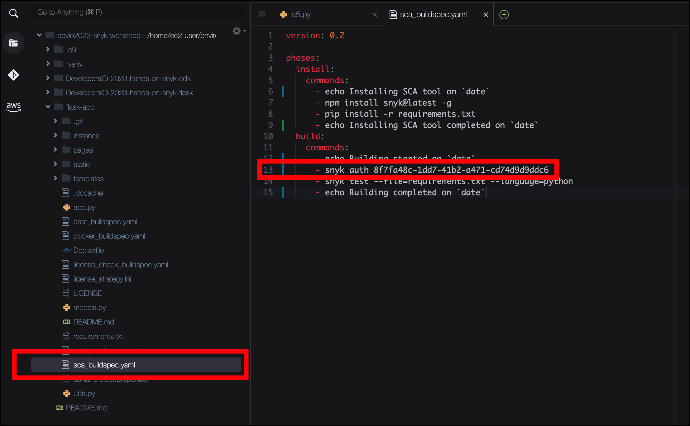

# Snyk Token のセットアップ

CI （ CodeBuild ）に Snyk OSS を組み込むために、 トークンを設定します。

1\. CI に Snyk OSS を組み込みます。 **flask-app/sca_buildspec.yaml** の 13 行目を編集し、 Snyk Token を貼り付けます。



> **Warning**
>
> ワークショップの便宜上、ハードコーディングを行なっていますが、実際の商用環境で Snyk のトークンを利用する際は、ハードコーディングを避け、Systems Manager や Secrets Manager に保管するように設定してください。

2\. 変更をローカルリポジトリにコミットしておきましょう。

```bash
cd ~/environment/flask-app
git commit -a -m "Setting up SCA BuildSpec"
git push
```

[Next: 依存関係のチェック](./check-the-dependencies.md)